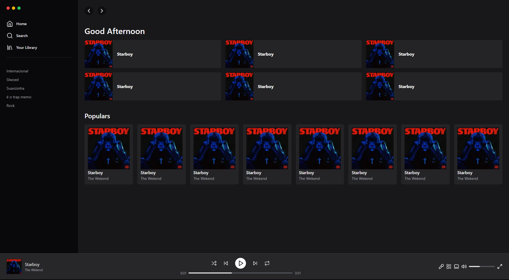

# Spotify App

## Description
This is a Spotify Layout not responsive, Developed by watching a youtube video by [rocktseat](https://www.youtube.com/watch?v=YVI-q3idGiM), this layout was developed with tailwind, typescript and nextjs. I did this to learn new talwind usabilities

## Images

## Installation
1. Clone the repository: `git clone https://github.com/edgargavioli/spotify-not-responsive-layout`
2. Install the dependencies: `yarn install`

## Usage
1. Run the app: `yarn start`
2. Open your web browser and navigate to `http://localhost:3000`

## Technologies Used
- Next.js
- Typescript
- Tailwind
- Lucide React